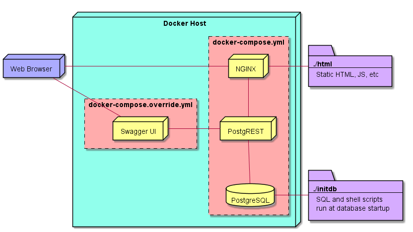

# compose-postgrest

[Postgres](https://www.postgresql.org/), [PostgREST](https://github.com/begriffs/postgrest), and [Swagger UI](https://github.com/swagger-api/swagger-ui) conveniently wrapped up with docker-compose.

Place SQL into the `initdb` folder, get REST!
Includes [world sample database](https://www.postgresql.org/ftp/projects/pgFoundry/dbsamples/world/).

Contains a simple front-end  demo application.

## Architecture

## Usage

### Start the containers

`docker-compose up -d`

### Tearing down the containers

`docker-compose down --remove-orphans -v`

## Demo Application

Located at <https://localhost>

### SwaggerUI API docs

* <https://localhost/swagger/>

### Postgrest

Located at <https://localhost/postgrest/>

Try things like:

* <https://localhost/postgrest/city>
* <https://localhost/postgrest/country>
* <https://localhost/postgrest/countrylanguage>
* <https://localhost/postgrest/city?name=eq.Denver>
* <https://localhost/postgrest/city?population=gte.5000000>
* <https://localhost/postgrest/city?district=like.*Island>
* <https://localhost/postgrest/city?district=like.*Island&population=lt.1000&select=id,name>
