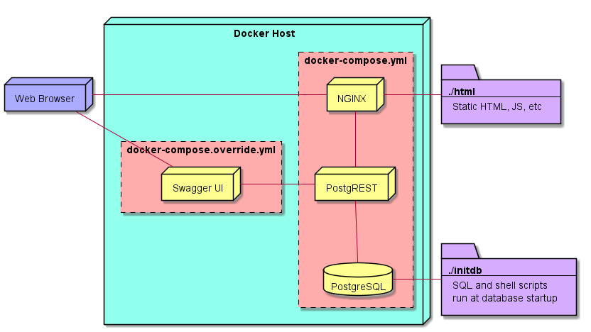

# compose-postgrest

[Postgres](https://www.postgresql.org/), [PostgREST](https://github.com/begriffs/postgrest), and [Swagger UI](https://github.com/swagger-api/swagger-ui) conveniently wrapped up with docker-compose. [Caddy](https://caddyserver.com/) serves as a reverse proxy with automatic HTTPS.

Place SQL into the `initdb` folder, get REST!

Contains a simple front-end demo application.

## Architecture



### Compose File Structure

- `docker-compose.yml` — core services: PostgreSQL, PostgREST, Swagger UI
- `docker-compose.override.yml` — Caddy reverse proxy (automatically loaded by `docker compose up`)
- `docker-compose.prod.yml` — production overlay: joins external `proxy` network for deployment behind a shared reverse proxy
- `Caddyfile` — static reverse proxy routing configuration

## Usage

### Start the stack

```bash
docker compose up -d
```

### Stop the stack

```bash
docker compose down
```

### Full reset (removes all data and volumes)

```bash
docker compose down --remove-orphans -v
```

### View logs

```bash
# All services
docker compose logs -f

# Single service
docker compose logs -f postgrest
```

### Restart a single service

```bash
docker compose restart postgrest
```

### Running without Caddy (direct access to services)

```bash
docker compose -f docker-compose.yml up -d
```

PostgREST is then available on port 3000 (if exposed in compose).

### Production deployment (behind bsvr-proxy)

```bash
docker compose -f docker-compose.yml -f docker-compose.prod.yml up -d
```

This skips the local Caddy and joins the external `proxy` network instead.

### Connect to the database

```bash
docker exec -it postgrest-db psql -U postgres -d postgrest
```

### Re-initialize the database

The init script only runs on first startup. To re-run it:

```bash
docker compose down -v
docker compose up -d
```

## Endpoints

| Endpoint | URL | Description |
|----------|-----|-------------|
| PostgREST API | https://localhost/postgrest/ | OpenAPI spec (JSON) |
| Swagger UI | https://localhost/swagger/ | Interactive API documentation |
| Table query | https://localhost/postgrest/test | Query the `test` table |
| View query | https://localhost/postgrest/view_of_test | Query the `view_of_test` view |

All endpoints use HTTPS with Caddy's auto-generated localhost certificate. Use `curl -k` or trust the Caddy root CA to avoid TLS warnings.

### PostgREST Query Examples

```bash
# Get all rows (capped at PGRST_DB_MAX_ROWS)
curl -sk https://localhost/postgrest/test

# Filter by date range
curl -sk 'https://localhost/postgrest/test?ts=gt.2025-01-01&ts=lt.2026-01-01'

# Select specific columns
curl -sk 'https://localhost/postgrest/test?select=id,name,val'

# Pattern matching
curl -sk 'https://localhost/postgrest/test?name=ilike.*abc*'

# Aggregates (requires PGRST_DB_AGGREGATES_ENABLED=true)
curl -sk 'https://localhost/postgrest/test?select=val.count(),val.sum(),val.avg()'

# Pagination
curl -sk 'https://localhost/postgrest/test?limit=10&offset=20'

# Ordering
curl -sk 'https://localhost/postgrest/test?order=val.desc'

# Query a view
curl -sk https://localhost/postgrest/view_of_test
```

See the [PostgREST API docs](https://docs.postgrest.org/en/v12/references/api.html) for the full query syntax.

## Configuration

All configuration is in `.env`:

| Variable | Default | Purpose |
|----------|---------|---------|
| `DOMAIN` | `localhost` | Hostname for Caddy TLS |
| `POSTGRES_USER` / `POSTGRES_PASSWORD` | `postgres` / `postgres` | PostgreSQL superuser |
| `POSTGREST_DB` | `postgrest` | Database for PostgREST |
| `POSTGREST_USER` / `POSTGREST_PASSWORD` | `postgrest_user` / `postgrest_pass` | Unprivileged PostgREST database user |
| `DB_SCHEMA` | `testschema` | Schema exposed as API |
| `DB_ANON_ROLE` | `anon` | Anonymous API access role |
| `POSTGREST_SUBPATH` | `/postgrest` | URL path prefix |
| `PGRST_DB_MAX_ROWS` | `1000` | Maximum rows per response |
| `PGRST_DB_POOL` | `2` | Connection pool size |
| `PGRST_DB_POOL_ACQUISITION_TIMEOUT` | `10` | Seconds to wait for a pool connection |

Additional production settings are available as comments in `.env` (error verbosity, OpenAPI mode, pool lifecycle, logging, admin health endpoint).
